<div align="center">



# Hi, I'm Matthew 👋

**Computer science student building at the intersection of intelligent software and reliable systems.**

`Python` · `C++` · `Machine learning` · `Distributed systems` · `Prometheus + Grafana`

[Explore projects](#projects) · [Open the control panel](#control-panel) · [Say hello](#say-hello)

</div>

---

### About me

I'm a computer science major at **Oral Roberts University, class of 2028**, based in Tulsa, Oklahoma. I enjoy projects that make software *see*, *communicate*, and *explain what it's doing*. My interests span Python, C++, machine learning, distributed systems, and observability with Prometheus and Grafana workspaces.

### Control panel

This README has a few doors. Choose a signal to see where it leads.

<details>
<summary>🧠 <strong>MODE 01 · Make software see</strong></summary>

<br />

Computer vision is one of the places where code becomes tangible: give a program an image and ask it to extract something useful.

**Projects:** [CVLicensePlateReader](https://github.com/mattloughlin821/CVLicensePlateReader) · [facialAttendanceScanner](https://github.com/mattloughlin821/facialAttendanceScanner)

</details>

<details>
<summary>🌐 <strong>MODE 02 · Understand the system</strong></summary>

<br />

I'm interested in how systems behave beneath the interface: networks, caches, concurrency, and the decisions that make distributed software dependable.

**Projects:** [tcpPortScanner](https://github.com/mattloughlin821/tcpPortScanner) · [cacheSim](https://github.com/mattloughlin821/cacheSim)

</details>

<details>
<summary>📈 <strong>MODE 03 · Watch it work</strong></summary>

<br />

I like the observability side of engineering: turning raw behavior into useful signals with Prometheus, then making those signals readable in Grafana workspaces.

</details>

<details>
<summary>✨ <strong>MODE 04 · Find the easter egg</strong></summary>

<br />

The banner has a tiny star away from the main constellation. It is a reminder to keep looking past the obvious path. ⭐

```text
> curiosity --status
ACTIVE
> next_step
Build something worth understanding.
```

</details>

### Projects

| Repository | What you'll find |
| :--- | :--- |
| [CVLicensePlateReader](https://github.com/mattloughlin821/CVLicensePlateReader) | A Python computer vision project for reading license plates. |
| [facialAttendanceScanner](https://github.com/mattloughlin821/facialAttendanceScanner) | A Python project exploring face based attendance scanning. |
| [tcpPortScanner](https://github.com/mattloughlin821/tcpPortScanner) | A TCP port scanner built with Python's socket library. |
| [cacheSim](https://github.com/mattloughlin821/cacheSim) | A set associative cache simulation for computer logic and organization. |

<details>
<summary>🗂️ <strong>See every public repository</strong></summary>

<br />

[Browse all repositories →](https://github.com/mattloughlin821?tab=repositories)

</details>

### What I'm exploring

```text
INPUT       Python · C++ · ML
SYSTEM      Distributed systems · networks · computer architecture
SIGNALS     Prometheus · metrics · Grafana workspaces
OUTPUT      Tools that are useful, observable, and fun to understand
```

### Say hello

Have a project idea, a good systems question, or a useful Grafana trick? [Open a guestbook note](https://github.com/mattloughlin821/mattloughlin821/issues/new?template=guestbook.yml), or [find me on GitHub](https://github.com/mattloughlin821).

<div align="center">

<sub>Thanks for visiting. Try opening a different door on your way out.</sub>

</div>
